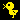

##### _If you want to see this page in ENGLISH,Please click [HERE](#tybobs-homepageenglish)._

# ぼぶ's ホームページ 

### ドット絵メーカーのバージョン履歴は[こちら](dotmaker/version.md)から

* [トップページ](https://tybob8010.github.io)
* [プライバシーポリシー](https://tybob8010.github.io/privacy/)
* [利用規約](https://tybob8010.github.io/terms/)
* [ドット絵メーカー](https://tybob8010.github.io/dotmaker/)
* [カラーコード](https://tybob8010.github.io/colorcode/)
* [ラングトンのアリ](https://tybob8010.github.io/langton-s-ant)
* [ライフゲーム](https://tybob8010.github.io/lifegame)
* [ジョジョスタンドジェネレーター](https://tybob8010.github.io/jojostand)

# tybob's HOMEPAGE(ENGLISH) 

### The version history of "dotmaker" can be found [HERE](dotmaker/version.md) (There's no English)

* [Top Page](https://tybob8010.github.io)
* [Privacy Policy](https://tybob8010.github.io/privacy/)
* [Terms of Service](https://tybob8010.github.io/terms/)
* [dotmaker](https://tybob8010.github.io/dotmaker/)
* [colorcode](https://tybob8010.github.io/colorcode/)
* [Langton's Ant](https://tybob8010.github.io/langton-s-ant)
* [Life Game](https://tybob8010.github.io/lifegame)
* [JOJO Stands Generator](https://tybob8010.github.io/jojostand)